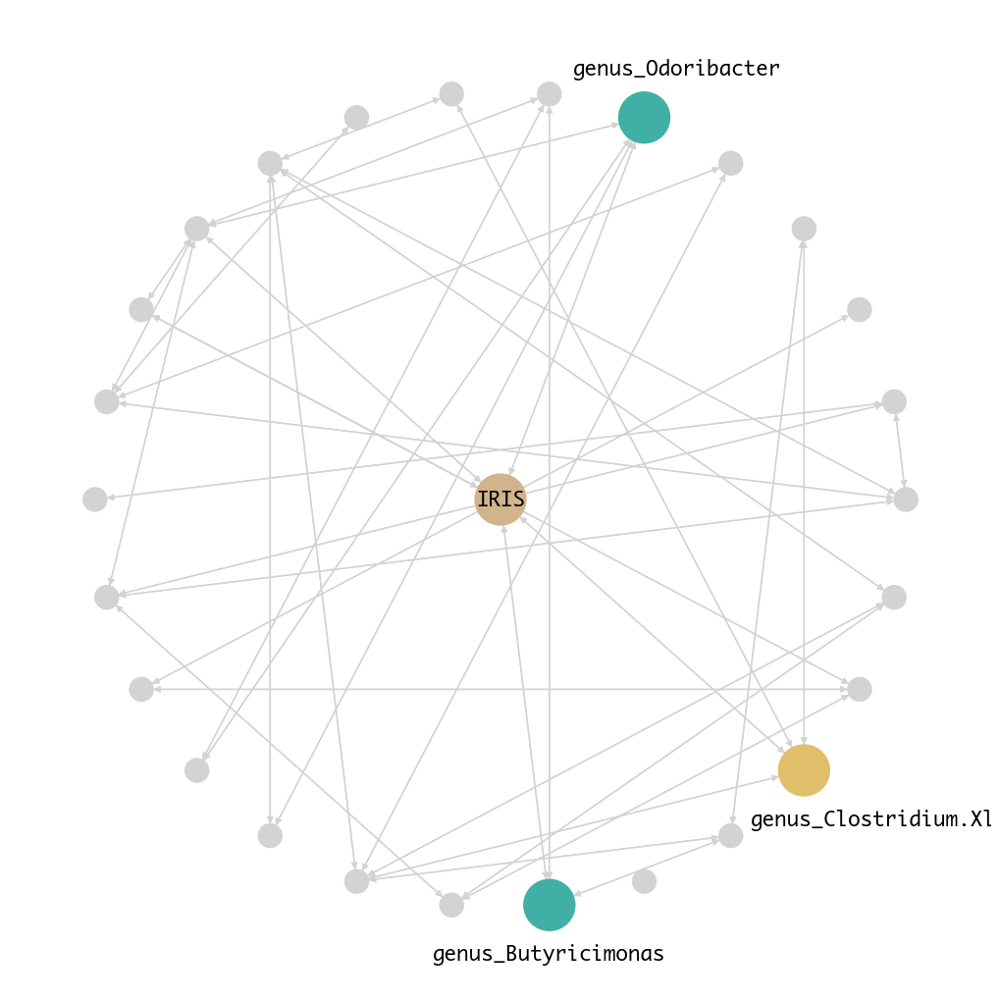
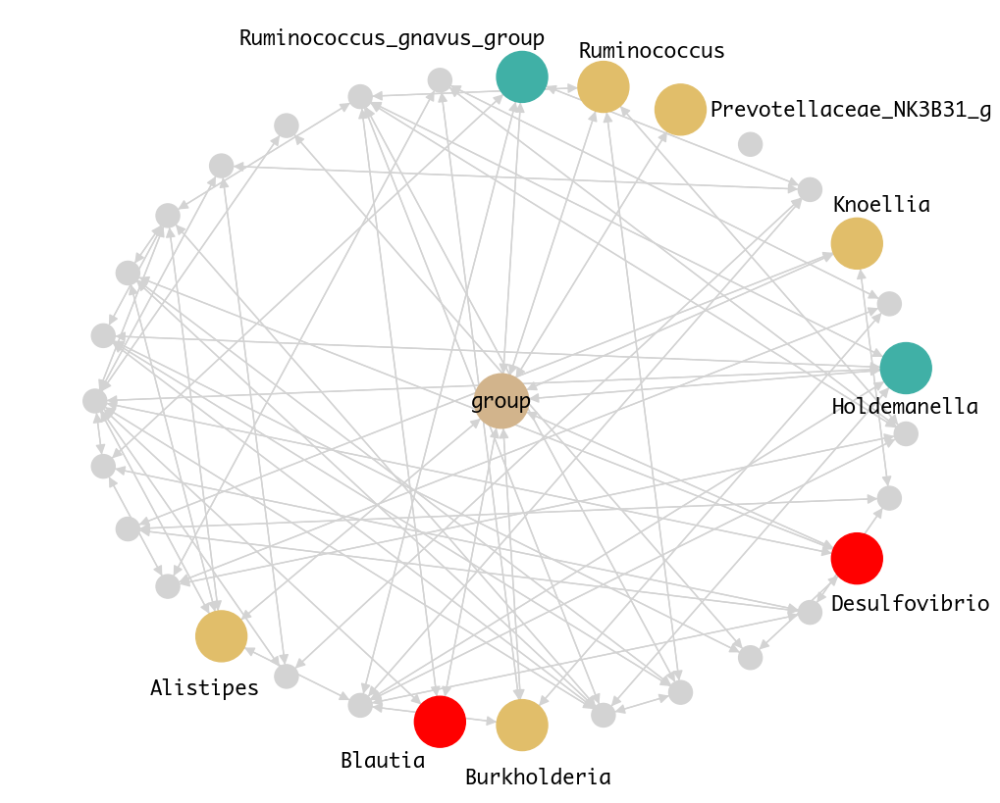
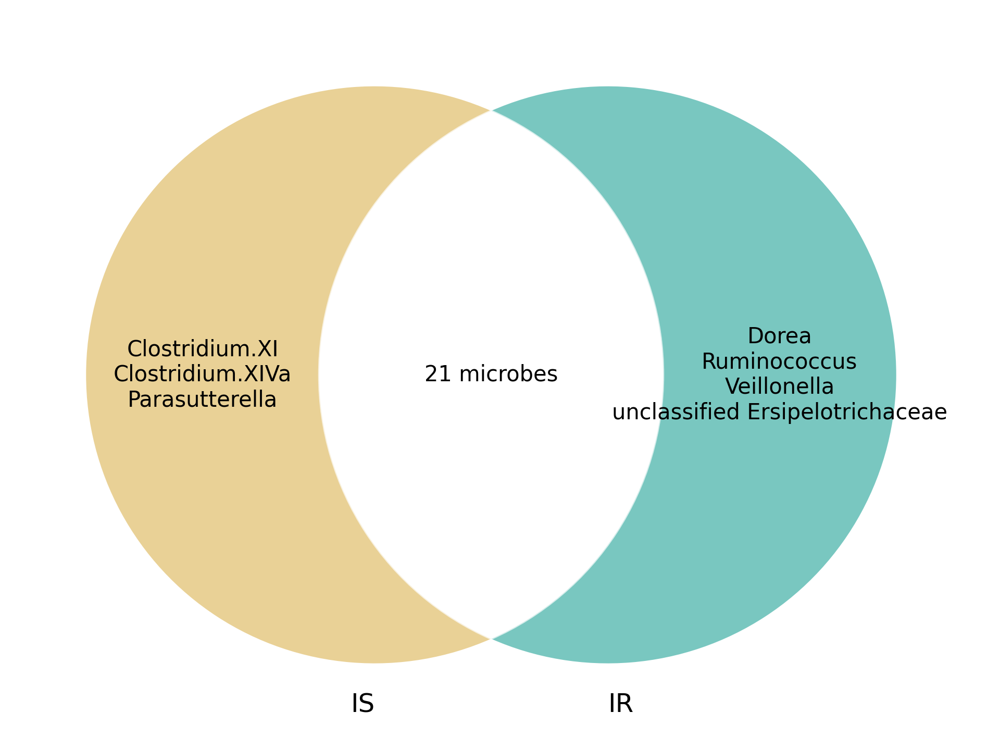
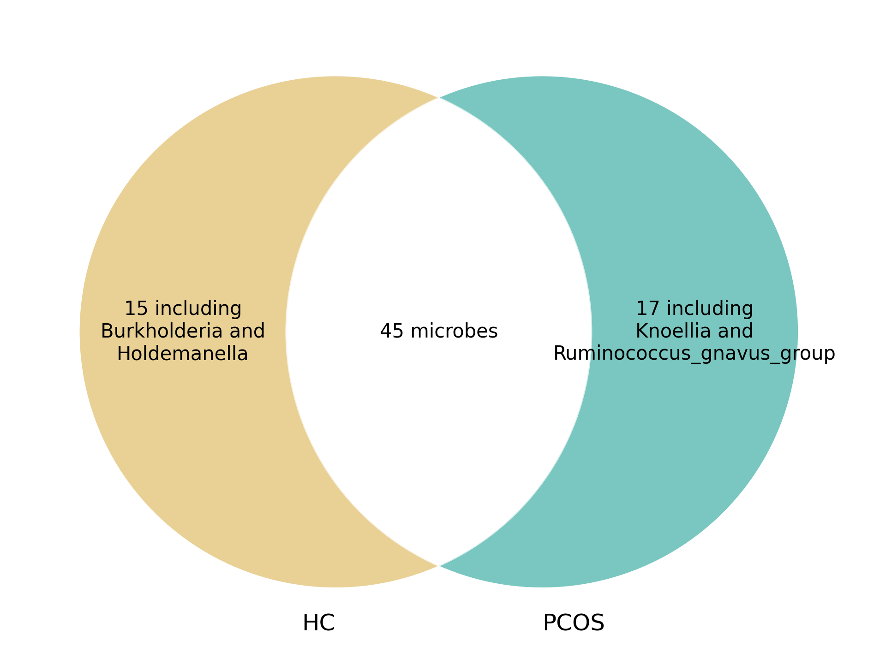

# Causal Discovery on Gut Microbial Data for Disease Risk Prediction

## Authors
**Mariana Paco Mendivil**, **Candus Shi**, **Nicole Zhang**  
**Mentors**: Dr. Biwei Huang, Dr. Jelena Bradic  

## Background
### Causal Discovery & Causal Inference
Causal discovery methods aim to infer causal relationships from observational data, providing an alternative to costly or unethical randomized controlled trials (RCTs). These methods allow us to understand causal interactions rather than mere associations.

### Gut Microbiome and Disease
The gut microbiome is an essential component of human health, influencing metabolic, immune, and neurological functions. While prior studies have reported microbial associations with diseases, these do not establish causation. Our research applies causal discovery techniques to gut microbial data to infer causal relationships with disease status.

## Research Questions
1. **Microbe-Microbe Interactions**: How do microbial interaction networks differ between healthy and diseased participants?
2. **Microbe-Disease Relationships**: Which microbes have a causal effect on disease status, and how can this be quantified?
3. **Prediction**: Can causal representation learning improve disease prediction over standard methods?

## Data
We analyze gut microbiome datasets related to **Type 2 Diabetes (T2D)** and **Polycystic Ovary Syndrome (PCOS)**:

- **T2D Data**: NIH Human Microbiome Project (HMP2) dataset (filtered for healthy visits, 16S sequencing).  
  - **Samples**: 153 insulin-sensitive (IS) & 178 insulin-resistant (IR).
- **PCOS Data**: Meta-analysis dataset from 14 clinical studies across Asia and Europe.
  - **Samples**: 435 healthy controls (HC) & 513 PCOS patients.

## Causal Discovery
Causal discovery attempts to recover the true causal structure of a system given observed data.
One way to model this causal structure is through a directed graphical model. A widely-used
general-purpose causal discovery algorithm is the Peter-Clark (PC) algorithm:
1. Start with a complete undirected graph (each node connected to all other nodes).
2. Remove edges based on statistical independence and conditional independence tests.
3. Identify v-structures (patterns like X → Y ← Z) to infer causal directions.
4. Apply Meek’s rules to orient additional edges while preserving v-structures.
The result is a CPDAG (Completed Partially Directed Acyclic Graph), which represents a set
of causal structures consistent with the observed data, also known as the Markov Equivalence
Class (MEC).

## Methods
1. **Feature Selection**
   - Remove rare OTUs (<1% relative abundance).
   - Use SparCC and Graphical Lasso to filter microbe-microbe interactions.
   - Apply Lasso Logistic Regression to identify disease-relevant microbes.

2. **Causal Discovery Algorithms**
   - PC-Stable (max depth = 2) for microbe-microbe networks.
   - CD-NOD to model heterogeneity in microbe-disease relationships.

3. **Causal Effect Estimation**
   - Use do-calculus and logistic regression to estimate individual microbial effects.
   - Compare results with Bayesian Inferential Regression for Differential Microbiome Analysis (BIRDMAn).

4. **Predictive Modeling**
   - Train variational autoencoders (VAEs) to learn microbial feature representations.
   - Compare logistic regression with VAE representations for disease prediction.

## Results
### Type 2 Diabetes (T2D)
Our microbe-disease network identified five genera with causal effects on T2D:
- **Butyricimonas, Clostridium XIVb, Odoribacter, Unclassified Bacteria, Unclassified Firmicutes**

**Figure 1.** Microbe-Disease Network for T2D.

Using do-calculus, we estimated their causal effects on T2D.

| Genus                    | Model 1     | Model 2     | BIRDMAn    | Literature Agreement |
|--------------------------|------------|------------|------------|----------------------|
| *Butyricimonas*         | -2.0070    | -2.2664   | -5.19385  | Yes                  |
| *Clostridium XIVb*      | 1.54212   | 1.88022   | 2.15788   | Inconclusive         |
| *Odoribacter*           | -1.46989  | -3.055047 | -2.43796  | N/A                |
| *unclassified Bacteria* | -0.12991  | -0.12284  | 0.12409   | N/A                |
| *unclassified Firmicutes* | -0.69477 | -0.933718 | -1.47437  | N/A                |

*Table 1. Log-Odds Ratios for Models 1 & 2, and Mean CLR from BIRDMAn for T2D.*

### Model Descriptions
- **Model 1**: logit(disease status) ~ microbes directly linked  
- **Model 2**: logit(disease status) ~ microbe + neighbors(microbe) or mediators  
- **BIRDMAn**: Bayesian inference with NegBinomial(μ, φ)

### Polycystic Ovary Syndrome (PCOS)
Our microbe-disease network for PCOS identified nine causal genera:
- **Alistipes, Blautia, Burkholderia, Desulfovibrio, Holdemanella, Knoellia, Prevotellaceae NK3B31 group, Ruminococcus, Ruminococcus gnavus group**

**Figure 2.** Microbe-Disease Network for PCOS.

Using do-calculus, we estimated their causal effects on PCOS.

| Genus                           | Model 1     | Model 2     | BIRDMAn    | Literature Agreement |
|---------------------------------|------------|------------|------------|----------------------|
| *Alistipes*                     | 0.13272   | 0.15346   | 1.28613   | Inconclusive         |
| *Blautia*                       | 0.07461   | 0.07008   | 0.82554   | No                   |
| *Burkholderia*                  | -7.6059   | -0.48578  | -10.95696 | Inconclusive         |
| *Desulfovibrio*                 | -0.79283  | -1.14492  | -0.17153  | No                   |
| *Holdemanella*                  | -0.22801  | -1.07267  | -0.13299  | Yes                  |
| *Knoellia*                      | 592.26751  | 1.40864   | 5.57650   | Inconclusive         |
| *Prevotellaceae NK3B31 group*   | -0.42407  | -0.47231  | -1.76743  | Inconclusive         |
| *Ruminococcus*                  | -0.14137  | -0.13490  | -0.12796  | Inconclusive         |
| *Ruminococcus gnavus group*     | 0.24152   | 0.18259   | 2.01842   | Yes                  |

*Table 2. Log-Odds Ratios for Models 1 & 2, and Mean CLR from BIRDMAn for PCOS.*

### Microbe-Microbe Interactions

To further analyze microbial community structure, we constructed microbe-microbe interaction networks for both conditions. The Venn diagrams below illustrate shared and unique microbial interactions within T2D and PCOS:

**T2D Microbe-Microbe Interactions**

*Figure 3. Venn diagram of microbe-microbe interactions in T2D.*

**PCOS Microbe-Microbe Interactions**

*Figure 4. Venn diagram of microbe-microbe interactions in PCOS.*

These interactions highlight disease-specific microbial relationships and may provide insight into community-level effects that influence disease progression and microbial ecology.

## Discussion  

Our study highlights the potential **causal role of gut microbes** in metabolic diseases like **Type 2 Diabetes (T2D) and Polycystic Ovary Syndrome (PCOS)**. We identified **distinct microbial compositions** for each condition, with some genera overlapping between the two.  

### **Key Microbial Findings**  

#### **T2D**  
- **Butyricimonas** and **Odoribacter** appear protective, reducing insulin resistance risk. Both are butyrate-producing bacteria, known for their positive effects on metabolism.  

#### **PCOS**  
- **Blautia** emerged as a beneficial microbe, linked to improved glucose and lipid metabolism.  
- **Desulfovibrio** appears harmful, associated with chronic inflammation, which is a common feature in PCOS and inflammatory bowel disease (IBD).  
- **Holdemanella** may have anti-inflammatory effects, potentially influencing gut microbial networks and GLP-1 hormone regulation (important for blood sugar control).  
- **Ruminococcus gnavus group** was linked to gut dysbiosis and inflammation, which may contribute to PCOS-related metabolic disturbances.  

### **Uncertain Microbes & Study Limitations**  
For microbes like **Clostridium XIVb, Alistipes, Burkholderia, Knoellia, and Ruminococcus**, findings were inconclusive, as some species within these genera may have opposing effects. Since our analysis was at the genus level, we could not assess species-specific impacts, which is a key limitation.  

## Conclusion & Future Work
1. **Microbe-Microbe Interactions**: Healthy and diseased participants share certain microbes but differ in their interactions. Microbes should be analyzed as communities rather than isolated entities.
2. **Microbe-Disease Causality**: Using CD-NOD and do-calculus, we quantified microbial effects on disease status. Our findings align with differential abundance methods like **BIRDMAn** and existing literature.
3. **Prediction**: Baseline models (e.g., logistic regression) outperform VAE-based models. Future work should explore longitudinal data to improve microbial feature representation.

### Future Directions
- Adjust for multiple testing and low statistical power.
- Apply different causal discovery algorithms for diverse data structures (e.g., longitudinal studies, meta-analyses).
- Address compositionality and rareness in microbiome data.

We hope this project shows the potential of causal discovery and causal inference methods in
human gut microbiome research, and can be generically applied to other diseases of interest. We
would like to thank our mentors, Dr. Biwei Huang & Dr. Jelena Bradic, and Dr. Sam Degregori
(Knight Lab) for guidance throughout this project

## More Information
Visit our project GitHub:  
[https://github.com/nzhang20/Causal-Discovery-on-Gut-Microbial-Data-for-Disease-Risk-Prediction/](https://github.com/nzhang20/Causal-Discovery-on-Gut-Microbial-Data-for-Disease-Risk-Prediction/)

