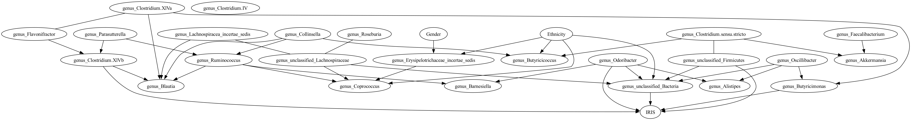
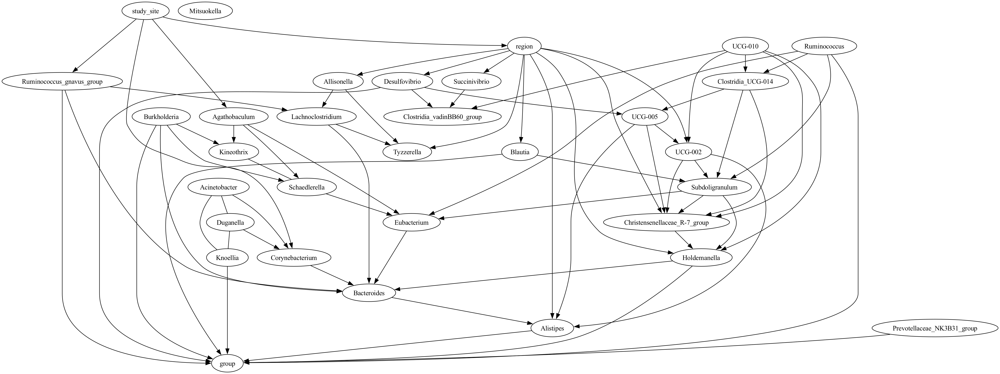

# Causal Discovery on Gut Microbial Data for Disease Risk Prediction

## Authors
**Mariana Paco Mendivil**, **Candus Shi**, **Nicole Zhang**  
**Mentors**: Dr. Biwei Huang, Dr. Jelena Bradic  

## Background
### Causal Discovery & Causal Inference
Causal discovery methods aim to infer causal relationships from observational data, providing an alternative to costly or unethical randomized controlled trials (RCTs). These methods allow us to understand causal interactions rather than mere associations.

### Gut Microbiome and Disease
The gut microbiome is an essential component of human health, influencing metabolic, immune, and neurological functions. While prior studies have reported microbial associations with diseases, these do not establish causation. Our research applies causal discovery techniques to gut microbial data to infer causal relationships with disease status.

## Research Questions
1. **Microbe-Microbe Interactions**: How do microbial interaction networks differ between healthy and diseased participants?
2. **Microbe-Disease Relationships**: Which microbes have a causal effect on disease status, and how can this be quantified?
3. **Prediction**: Can causal representation learning improve disease prediction over standard methods?

## Data
We analyze gut microbiome datasets related to **Type 2 Diabetes (T2D)** and **Polycystic Ovary Syndrome (PCOS)**:

- **T2D Data**: NIH Human Microbiome Project (HMP2) dataset (filtered for healthy visits, 16S sequencing).  
  - **Samples**: 153 insulin-sensitive (IS) & 178 insulin-resistant (IR).
- **PCOS Data**: Meta-analysis dataset from 14 clinical studies across Asia and Europe.
  - **Samples**: 435 healthy controls (HC) & 513 PCOS patients.

## Methods
### Causal Discovery
Causal discovery seeks to recover the true causal structure of a system using observed data. We model this structure using **directed graphical models** and apply the following algorithms:

1. **Feature Selection**
   - Remove rare OTUs (<1% relative abundance).
   - Use **SparCC** and **Graphical Lasso** to filter microbe-microbe interactions.
   - Apply **Lasso Logistic Regression** to identify disease-relevant microbes.

2. **Causal Discovery Algorithms**
   - **PC-Stable** (max depth = 2) for microbe-microbe networks.
   - **CD-NOD** to model heterogeneity in microbe-disease relationships.

3. **Causal Effect Estimation**
   - Use **do-calculus** and logistic regression to estimate individual microbial effects.
   - Compare results with Bayesian Inferential Regression for Differential Microbiome Analysis (**BIRDMAn**).

4. **Predictive Modeling**
   - Train **variational autoencoders (VAEs)** to learn microbial feature representations.
   - Compare **logistic regression** with VAE representations for disease prediction.

## Key Findings
### Type 2 Diabetes (T2D)
Our **microbe-disease network** identified five genera with causal effects on T2D:
- **Butyricimonas, Clostridium XIVb, Odoribacter, Unclassified Bacteria, Unclassified Firmicutes**

Using **do-calculus**, we estimated their causal effects on T2D.

### Polycystic Ovary Syndrome (PCOS)
Our **microbe-disease network** for PCOS identified nine causal genera:
- **Alistipes, Blautia, Burkholderia, Desulfovibrio, Holdemanella, Knoellia, Prevotellaceae NK3B31 group, Ruminococcus, Ruminococcus gnavus group**

## Conclusion & Future Work
1. **Microbe-Microbe Interactions**: Healthy and diseased participants share certain microbes but differ in their interactions. Microbes should be analyzed as communities rather than isolated entities.
2. **Microbe-Disease Causality**: Using **CD-NOD** and **do-calculus**, we quantified microbial effects on disease status. Our findings align with differential abundance methods like **BIRDMAn** and existing literature.
3. **Prediction**: Baseline models (e.g., logistic regression) outperform VAE-based models. Future work should explore longitudinal data to improve microbial feature representation.

### Future Directions
- Adjust for **multiple testing** and **low statistical power**.
- Apply **different causal discovery algorithms** for diverse data structures (e.g., longitudinal studies, meta-analyses).
- Address **compositionality** and **rareness** in microbiome data.

We hope this project shows the potential of **causal discovery and causal inference methods** in
human gut microbiome research, and can be generically applied to other diseases of interest. We
would like to thank our mentors, Dr. Biwei Huang & Dr. Jelena Bradic, and Dr. Sam Degregori
(Knight Lab) for guidance throughout this project

## More Information
Visit our project GitHub:  
[https://github.com/nzhang20/Causal-Discovery-on-Gut-Microbial-Data-for-Disease-Risk-Prediction/](https://github.com/nzhang20/Causal-Discovery-on-Gut-Microbial-Data-for-Disease-Risk-Prediction/)

